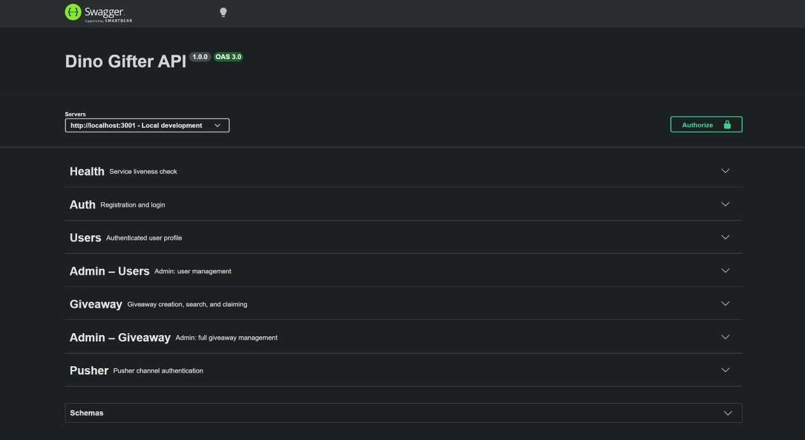

# nest-dino-gifter

Backend REST API for the Dino Gifter platform — a game-integrated service where users create dino giveaways that others can claim in real time.



## Technology Stack

| Layer | Technology |
|---|---|
| Framework | NestJS v11 |
| Language | TypeScript v5.7 |
| Database | PostgreSQL (via TypeORM v1) |
| Auth | Passport.js — local + JWT strategies |
| Real-time | Pusher |
| Validation | class-validator + class-transformer |
| Password hashing | bcrypt |
| Rate limiting | @nestjs/throttler |
| API docs | Swagger / OpenAPI (`/api/docs`) |
| Testing | Jest + Supertest |
| Deployment | Vercel |

## Architecture

The application follows NestJS's modular architecture. Each domain owns its controller, service, entities, DTOs, and guards.

```
AppModule
├── AuthModule        – JWT & local Passport strategies, guards, decorators
├── UsersModule       – User CRUD, admin user management
├── GiveawayModule    – Giveaway lifecycle + Pusher push on claim
├── PusherModule      – Pusher channel auth + event triggering
├── DatabaseModule    – TypeORM PostgreSQL config
├── HashingModule     – bcrypt abstraction
└── ThrottlerModule   – Global rate limiting
```

**Giveaway claim flow** (race-condition safe):
1. Claim request hits the API.
2. A database transaction acquires a `pessimistic_write` lock on the row.
3. Guards verify the giveaway is uncanceled, not yet claimed, and has passed its `activeAt` time.
4. The recipient is set and status transitions to `Pending`.
5. A Pusher event (`gift_dino`) is fired on the creator's private channel so the desktop client can perform the in-game gift action.

## Getting Started

### Prerequisites

- Node.js ≥ 20
- PostgreSQL database
- Pusher account (free tier works)

### Installation

```bash
npm install
```

### Environment variables

Create `.env.local` for local development (the app loads `.env.local` when `NODE_ENV=development`).

```env
# Server
PORT=3001
FRONTEND_URL=http://localhost:3000

# Database — use either DATABASE_URL or individual fields
DATABASE_URL=
DB_HOST=localhost
DB_PORT=5432
DB_USERNAME=postgres
DB_PASSWORD=
DB_NAME=dino_gifter

# JWT
JWT_SECRET=
JWT_ACCESS_TOKEN_TTL=3600   # seconds

# Rate limiting
THROTTLE_TTL=60000          # ms
THROTTLE_LIMIT=100

# Pusher
PUSHER_APP_ID=
PUSHER_KEY=
PUSHER_SECRET=
PUSHER_CLUSTER=
```

### Run the app

```bash
# development (watch mode)
npm run start:dev

# debug mode
npm run start:debug

# production
npm run start:prod
```

The API will be available at `http://localhost:3001`.
Swagger UI is at `http://localhost:3001/api/docs`.

### Database migrations

```bash
# generate a migration from entity changes
npm run migration:generate

# apply pending migrations
npm run migration:run

# revert the last migration
npm run migration:revert
```

## Project Structure

```
src/
├── main.ts                     # Bootstrap: CORS, pipes, Swagger, cookies
├── app.module.ts               # Root module
├── data-source.ts              # TypeORM DataSource for CLI
│
├── auth/
│   ├── strategies/             # local.strategy.ts, jwt.strategy.ts
│   ├── guards/                 # authentication.guard.ts, roles.guard.ts, …
│   ├── decorators/             # @Auth(), @CurrentUser(), @Roles()
│   ├── dto/                    # login.dto.ts, tokens-response.dto.ts
│   └── auth.service.ts
│
├── users/
│   ├── entities/user.entity.ts
│   ├── dto/                    # create, update, response DTOs (user + admin)
│   ├── users.controller.ts     # Authenticated user profile
│   └── admin-users.controller.ts
│
├── giveaway/
│   ├── entities/giveaway.entity.ts
│   ├── dto/
│   ├── giveaway.controller.ts  # Public-facing giveaway endpoints
│   ├── admin-giveaway.controller.ts
│   ├── giveaway.gateway.ts     # Pusher push service
│   └── giveaway.service.ts
│
├── pusher/
│   ├── pusher.service.ts
│   └── pusher.controller.ts    # POST /pusher/auth
│
├── common/
│   ├── enums/                  # GiveawayCompletionStatus, TrialType
│   ├── hashing/                # HashingService (bcrypt)
│   └── types/
│
├── database/
│   └── database.config.ts
│
└── migrations/
```

## Key Features

- **JWT authentication** with token version invalidation — logout increments `tokenVersion` on the user row, which invalidates all issued tokens instantly.
- **Role-based access control** — `Regular` and `Admin` roles enforced via `RolesGuard`.
- **Giveaway creation** — supports scheduled activation (`activeAt`), in-game server/slot targeting, and optional trial challenges.
- **Atomic giveaway claiming** — pessimistic row locking prevents double-claims under concurrent traffic.
- **Real-time push to creator** — Pusher private channel triggers the creator's desktop client to perform the in-game gifting action.
- **Admin API** — separate controller for full user and giveaway management.
- **Swagger docs** — auto-generated OpenAPI spec with bearer auth, served at `/api/docs`.
- **Global rate limiting** — configurable TTL/limit via environment variables.

## Scripts

| Script | Description |
|---|---|
| `npm run build` | Compile TypeScript via NestJS CLI |
| `npm run start:dev` | Dev server with hot reload |
| `npm run lint` | ESLint with auto-fix |
| `npm run format` | Prettier formatting |
| `npm run seed` | Run database seed script |
| `npm run openapi` | Generate OpenAPI JSON file |
| `npm run migration:generate` | Generate migration from entity diff |
| `npm run migration:run` | Apply pending migrations |
| `npm run migration:revert` | Revert last migration |

## Deployment

The project includes a `vercel-build` script that compiles the app and runs pending migrations automatically on each deploy.

```bash
# install Vercel CLI, then:
vercel deploy
```

Set all environment variables in your Vercel project settings. Use `DATABASE_URL` (connection string) for the production database — SSL is enabled automatically when it is set.

## License

Private — UNLICENSED.
